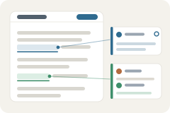

  

# Spec Workbench

  

Didn't work? Create a Minds workspace and paste this to your agent:
` /use-template https://github.com/trisiak/spec-workbench`

## Why you care

Planning and reviewing work with an agent happens in chat, where it scrolls
away: decisions get buried, and the document you actually care about lives
somewhere else. Spec Workbench flips that around. It makes a plain markdown
file the shared workspace -- you and your agent comment on it, thread on it,
suggest edits, and resolve them, Google-Docs style -- while every one of those
annotations is stored *inside the file itself*, so the whole conversation
stays versioned and diffable in git instead of trapped in a chat log or a
proprietary database.

## Status

Work in progress. The app is usable day-to-day (commenting, threads, the
notify loop, multi-file support), but several features are still being
built. The full picture lives in the app's own living spec --
[`docs/specs/spec_workbench.md`](docs/specs/spec_workbench.md) -- which
carries per-feature build status and is itself edited through the app.

## How to use it

Open any markdown file in the workbench and it renders as a two-column page:
your prose on the left, a margin of comment threads on the right.

- **Comment.** Select a phrase or click a section and leave a comment. It is
  written straight into the file as a blockquote thread anchored to that text.
  Reply in threads, and resolve them when you are satisfied.
- **Suggest.** Propose an edit as an inline diff anchored to the text it
  changes (one-click accept/reject is still to be implemented; the on-disk
  format already carries suggestion states).
- **Notify your agent.** One "notify agent" button stamps the document and
  pings your agent to sweep it -- read what is new, reply in the threads, do
  the work they ask for, and commit. The header counters tell you what is new
  for you and what you have not yet sent over. An optional message rides along
  with the press for extra context ("prioritize the perf thread").
- **Open any file.** The default view is the app's own living spec (a worked
  example of the format). Use the in-app "open file..." picker or
  `?doc=<path>` to point it at any markdown file in your workspace; agents can
  surface a document in your open tab with `uv run open-spec <path>`.
- **Everything is plain markdown.** Comments, replies, suggestions, and
  statuses are ordinary blockquotes in the file, so it stays readable on
  GitHub or in any editor, and the raw source is always one click away. A
  bundled quickstart (the `/quickstart` route) documents the full format.

## Ideas for making it yours

- **Use it beyond specs.** The format does not care what the markdown is about
  -- co-write a PRD, review meeting notes, or annotate a design doc with the
  same comment-and-thread loop.
- **Wire notify into more than chat.** Every press drops a durable JSON event
  under the app's data dir -- listen for those to trigger CI, a Slack ping, or
  any background job, not just an agent sweep.
- **Turn the document into a dashboard.** The per-section status grammar
  (`idea -> planned -> building -> done`) is plain text; build the rollup that
  reads it and shows project progress at the top of the page.
- **Annotate the running app, not just the file.** Extend it so a click on a
  live UI element leaves a thread in the document, bridging "comment on the
  app" and "comment on the spec".
- **Polish the raw view.** The one-click raw source is deliberately plain --
  add syntax highlighting, a diff-against-last-commit view, or a table of open
  threads.

## What this is

This repository is a published **minds template**: a clean, bootable
snapshot of what a mind built, ready to adapt into your own. It is NOT the
generic workspace template -- it is this specific project.

[`template.md`](template.md) is the full manifest -- what it is, how it
works, what it needs to run, and what to adapt -- with the
machine-readable half (recipe, requirements, and the environment it needs
installed) in [`template.toml`](template.toml).
